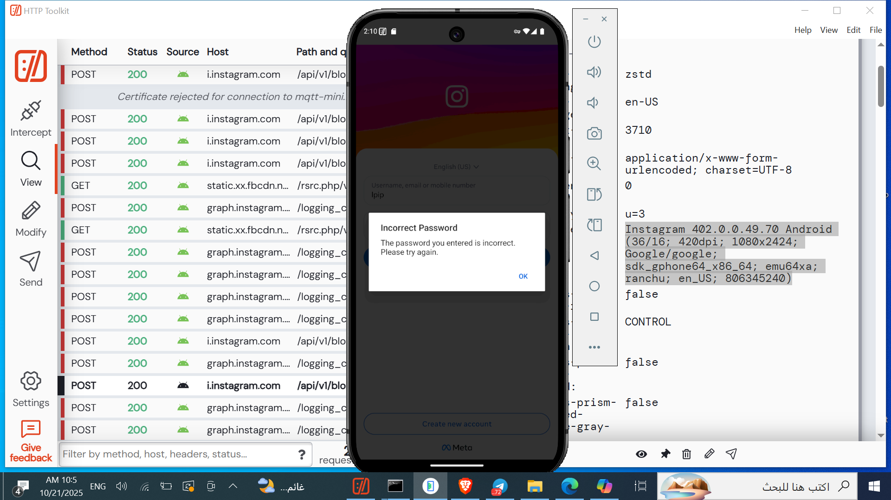

# instagram-ssl-pinning-bypass
This script lets you bypass SSL pinning on any Instagram app version.

Requirements:
- Frida
- A rooted Android device or rooted Android emulator.
- A request interception/analysis tool (e.g., Burp Suite, HTTP Toolkit, mitmproxy, or any proxy with an installed CA).
- Direct access to the device/emulator (adb / frida-server installed & running on the device).
- 

